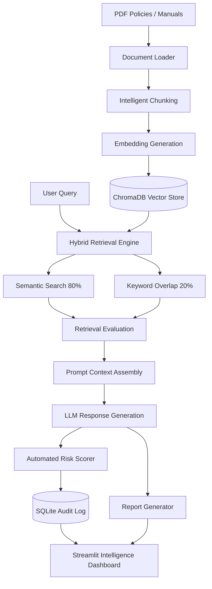

# Regulatory Compliance Intelligence Platform

An enterprise-grade, local-first Retrieval-Augmented Generation (RAG) platform designed to enable compliance officers, risk analysts, auditors, and legal teams to investigate and analyze corporate policies, regulatory manuals, and audit reports using natural language. 

The platform features a **Hybrid Search engine** (semantic vectors + keyword overlap), a **Search Evaluation Framework** (calculating live retrieval precision and recall), **Automated Compliance Risk Scoring**, **Audit Trail Logging (SQLite)**, and an **Executive Report Generator** producing markdown and PDF outputs.

---

## System Architecture

The following diagram illustrates the flow of information from policy documents ingestion to AI-powered answering, risk classification, SQLite logging, and report generation:



---

## Core Technologies & AI Engineering Principles

### 1. Minimal Framework Reliance (LangChain Minimization)
To avoid framework locks and demonstrate raw AI engineering practices, this application utilizes native APIs wherever possible. LangChain is restricted solely to the `RecursiveCharacterTextSplitter`. Other operations utilize:
* **PDF Ingestion:** `pypdf`
* **Embeddings Model:** `sentence-transformers`
* **Vector Store Client:** `chromadb`
* **LLM Calls:** Native `openai` client (OpenAI-compatible)
* **Metadata Logging:** `sqlite3` and `pandas`

### 2. Hybrid Retrieval Strategy
Modern enterprise databases contain specialized terminology (e.g., "KYC", "AML", "Article 9"). Vector distance models can sometimes miss exact matches of highly specific policy codes. The platform resolves this by computing a **Hybrid Retrieval Score** for each retrieved chunk:

$$\text{Final Score} = (0.8 \times \text{Semantic Cosine Similarity}) + (0.2 \times \text{Keyword Overlap Score})$$

* **Semantic Search:** Embeds the chunk and query using `all-MiniLM-L6-v2` (384-dimensional vector space) and measures Euclidean/Cosine distance.
* **Keyword Overlap:** Filters common stop words and computes the ratio of unique query tokens present in the text snippet.
* **Relevance Filtering:** Chunks falling below the configurable relevance threshold are filtered out to mitigate hallucinations.

### 3. RAG Retrieval Evaluation Framework
To monitor and ensure the reliability of semantic retrieval, the `src/evaluation.py` module computes several metrics:
* **Precision:** The proportion of retrieved snippets estimated to be relevant (using similarity score filters).
* **Recall:** The proportion of expected relevant information retrieved.
* **Hit Rate:** The frequency with which search queries return at least one valid policy document.
* **Average Similarity Score:** A health metric indicating semantic density.

### 4. Automated Risk Scoring Engine
The platform scans user inquiries and LLM generated compliance responses for critical keywords:
* **HIGH RISK:** `violation`, `fraud`, `breach`, `penalty`, `sanction`, `money laundering`.
* **MEDIUM RISK:** `review`, `exception`, `audit finding`, `escalation`.
* **LOW RISK:** `recommendation`, `guidance`, `advisory` (or no keywords detected).
The assigned risk level, along with a written compliance rationale, is logged and displayed to the user.

### 5. Executive Compliance Reporting & Governance
A critical enterprise requirement is report generation. The `src/report_generator.py` module takes the parameters of a search session (user query, RAG text answer, risk scores, precision/recall metrics, and citations) and exports:
1. **Markdown Report** (`reports/compliance_report_REP-XXXX.md`) for corporate wikis.
2. **Styled PDF Report** (`reports/compliance_report_REP-XXXX.pdf`) via `fpdf2` for email/regulatory submissions.

Every report has a unique **Report ID** (REP-XXXX) and complete audit information detailing the model name, run timestamp, and precision ratings, establishing traceability.

---

## Folder Structure

```text
regulatory-compliance-intelligence-platform/
├── app.py                     # Main Streamlit Dashboard UI
├── verify_project.py          # 15-Point Automated Test Suite
├── requirements.txt           # Package Dependencies
├── README.md                  # System Documentation
├── .gitignore                 # Excluded directories
├── data/                      # Folder for uploaded PDF files
├── vectorstore/               # ChromaDB persistent store
├── audit_logs/                # SQLite database and log exports
├── reports/                   # Generated MD/PDF audit reports
├── screenshots/               # Interface mockup captures
├── src/
│   ├── __init__.py            # Package Init
│   ├── loader.py              # pypdf loader
│   ├── chunker.py             # text chunker
│   ├── embeddings.py          # sentence-transformers factory
│   ├── vector_store.py        # ChromaDB client wrapper
│   ├── retrieval.py           # Hybrid search & ranking algorithm
│   ├── rag_pipeline.py        # Pipeline orchestrator
│   ├── risk_scoring.py        # Risk keyword classification
│   ├── audit_logger.py        # SQLite logger
│   ├── evaluation.py          # Precision/Recall evaluator
│   └── dashboard.py           # Altair charting helpers
```

---

## Installation & Setup

### Prerequisites
* Python 3.11
* Windows OS (supported shell: PowerShell)

### Step 1: Install Dependencies
```powershell
pip install -r requirements.txt
```

### Step 2: Set Environment Variables (Optional)
If using OpenAI services, set your API key:
```powershell
$env:OPENAI_API_KEY="your-openai-api-key"
```

### Step 3: Run Verification Suite
Verify the modules are functioning locally by executing:
```powershell
python verify_project.py
```
This runs 15 distinct tests checking loaders, chunkers, embeddings (using local CPU-based models), search vectors, scoring mechanisms, report generators, and audit logging.

### Step 4: Start Streamlit UI
```powershell
streamlit run app.py
```

---

## Enterprise Use Cases

### 1. Corporate & Investment Banking (CIB)
* **Question:** "What are the KYC guidelines for onboarding corporate clients based in high-risk jurisdictions?"
* **RAG Retrieval:** Finds the jurisdictional policy manual and highlights the enhanced due diligence requirements.
* **Risk Score:** MEDIUM (due to "KYC" and "jurisdictions" checking).

### 2. Insurance Claims Auditing
* **Question:** "Under what conditions can a standard property insurance claim be escalated for secondary fraud review?"
* **RAG Retrieval:** Matches exclusion terms in insurance guidelines.
* **Risk Score:** HIGH (due to "fraud" and "escalation" keywords).

### 3. Healthcare Regulation (HIPAA Compliance)
* **Question:** "What controls must be implemented to log employee access to patient records?"
* **RAG Retrieval:** Extracts audit trail specifications from security policies.
* **Risk Score:** LOW.

---

## Future Enhancements
* **Reranking:** Incorporate cross-encoder models (e.g., Cohere or local BGE rerankers) to further refine hybrid search results.
* **Role-Based Access Control (RBAC):** Restrict document ingestion and report visibility to authorized compliance administrators.
* **Multi-Agent Evaluation:** Deploy secondary AI agents to critique generated answers for potential compliance gaps or hallucinations.
* **Regulatory Feed API Integration:** Automatically stream regulatory updates (e.g., SEC, FCA feeds) to keep internal documents in sync.
